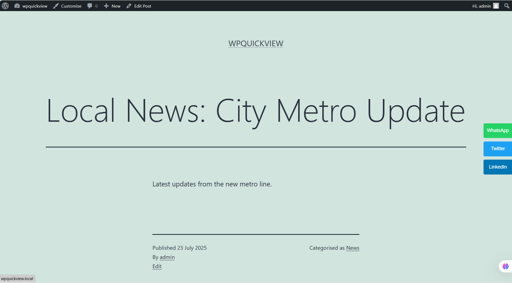
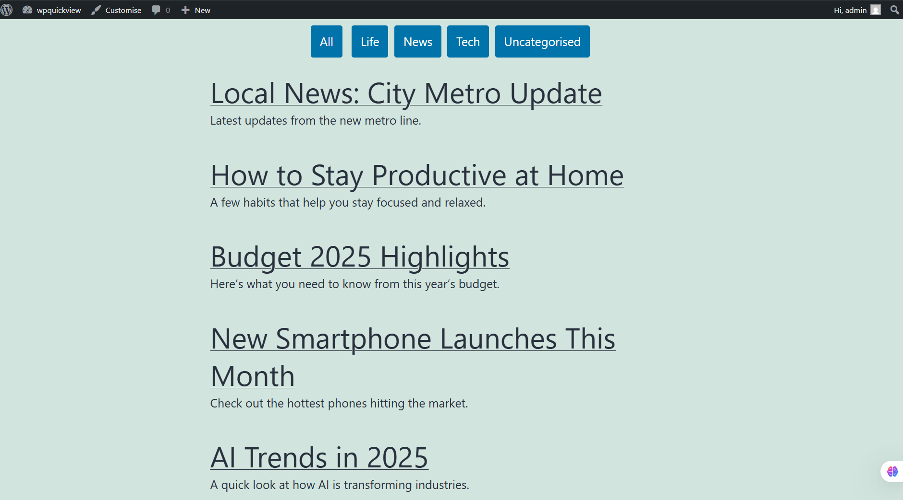

# WPQuickView – WordPress Enhancement Project

WPQuickView is a WordPress project consisting of:
1. A custom plugin for floating social share buttons
2. A theme tweak that adds category-based blog post filtering on the homepage

These features demonstrate hands-on skills in WordPress plugin development, PHP templating, and WP_Query.

---

## 📦 Plugin: Floating Social Share Buttons

A custom WordPress plugin that adds floating social share buttons (WhatsApp, Twitter, LinkedIn) to single blog posts. It enhances post shareability and user engagement.

### 🔧 Features
- 🟢 WhatsApp, 🔵 Twitter, 🔷 LinkedIn buttons
- Floating on-scroll visibility
- Automatically pulls current post URL and title
- Clean, responsive CSS

---

## 🧩 Theme Tweak: Category Filter Homepage

This theme tweak adds a filter bar at the top of the homepage that displays category buttons like `[ All ] [ Tech ] [ News ]`. Clicking a button filters posts using `WP_Query`.

### 🔧 Features
- Dynamically generated category buttons
- Filters posts using query string (e.g., `?cat=3`)
- Works with classic themes like Twenty Twenty-One
- Clean, styled layout

---

## 🛠 Tech Stack

- WordPress CMS
- PHP
- CSS
- WP_Query
- Classic Theme Templates
- WordPress Hooks & Template Tags

---
## 🖼️ Demo Screenshots

### 🔌 Floating Share Buttons

---

### 🧩 Category Filter Homepage

---

## 🙋‍♂️ Author

**Nakshatra Deshmukh**  
Final-year Computer Engineering student | Aspiring Developer | Ex-Intern @Accenture & EstherDataLabs

[GitHub](https://github.com/NakshatraDeshmukh) • [LinkedIn](https://linkedin.com/in/nakshatra-deshmukh)

---

## 📌 Note

- Tested locally using LocalWP
- Designed to demonstrate plugin + theme development skills 

